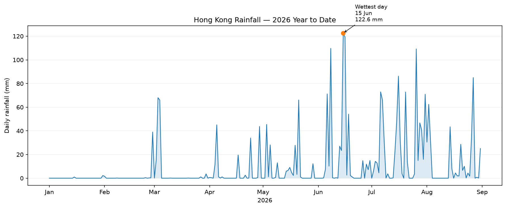

# Hong Kong Rainfall — 2026 Year to Date

## The phenomenon

Rain is a noticeable part of everyday life in Hong Kong. Since living here, I have noticed that the weather can change very quickly. Some days are completely dry, while heavy rain can suddenly affect transportation, outdoor activities, and daily plans.

This made me curious about when Hong Kong actually gets wet. I wanted to see whether rainfall is spread relatively evenly over time or concentrated on particular days and periods. Instead of only looking at a total rainfall number, I chose to look at the daily changes during 2026 so far.

## The source

The data comes from the Hong Kong Observatory (HKO), using its official weather and climate data. The raw rainfall data is saved in `data/hko-daily-rainfall-2026.csv`. It contains daily observations for 2026 so far, where each row represents one day and rainfall is measured in millimetres (mm).

Source: https://www.hko.gov.hk/en/cis/dailyExtract.htm?y=2026&m=0

## What the picture shows

The visualization shows how daily rainfall changes over time in Hong Kong during 2026 so far. Rainfall is not evenly distributed: many days have little or no rain, while several periods show sudden increases. The highest daily rainfall in the dataset is 122.6 mm on June 15.

I focused on rainfall amount and time to make this pattern easier to see. This transformation leaves out other weather information such as temperature, humidity, wind, and the duration or cause of individual rain events.

I also created an interactive web version where the rainfall data can be explored over time:

https://cshushs1.github.io/Rain/

## Run it

Fetch and save the source data:

    uv run fetch.py

Then generate the visualization:

    uv run plot.py

The raw data is stored in `data/`, and the generated image is saved in `out/`.
